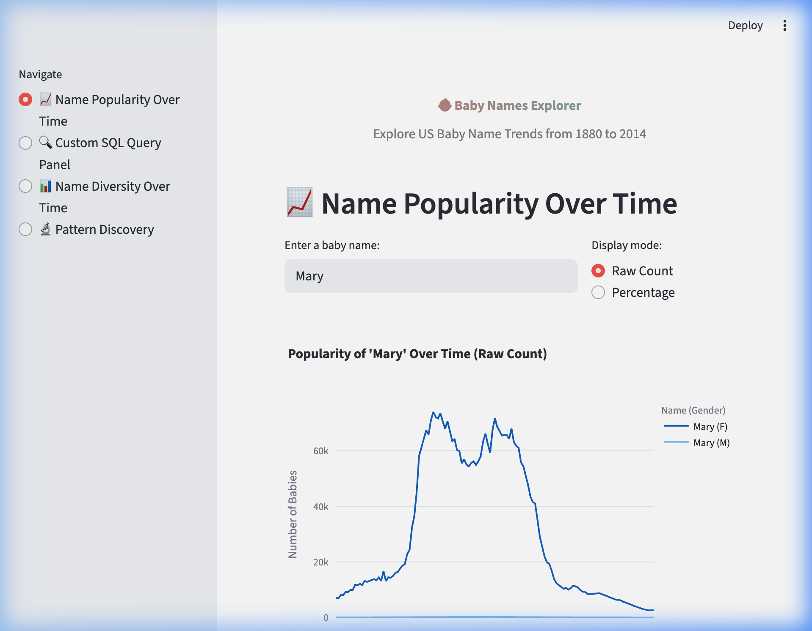
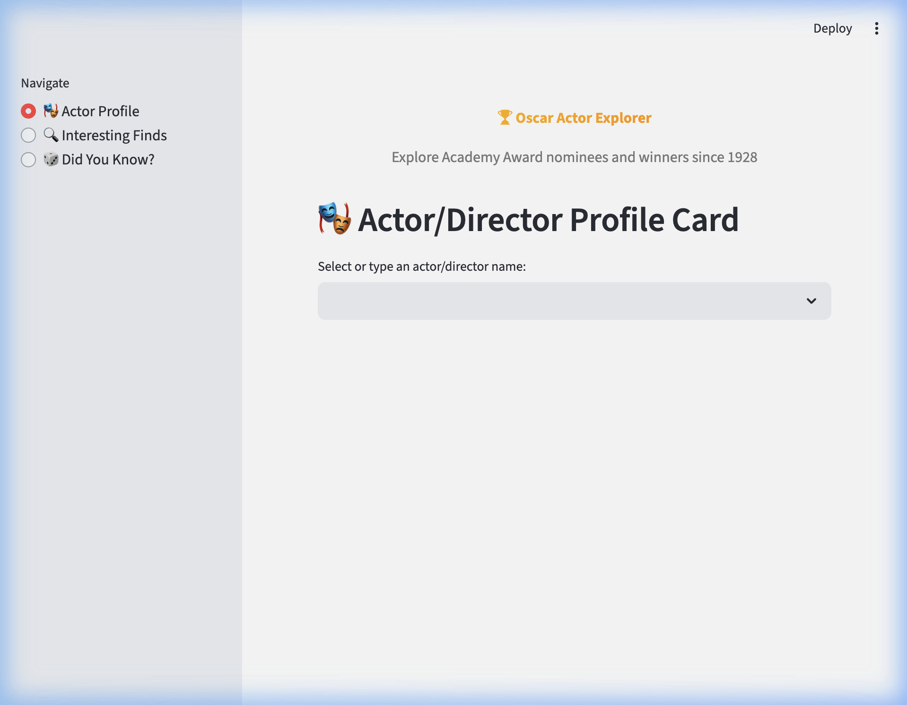
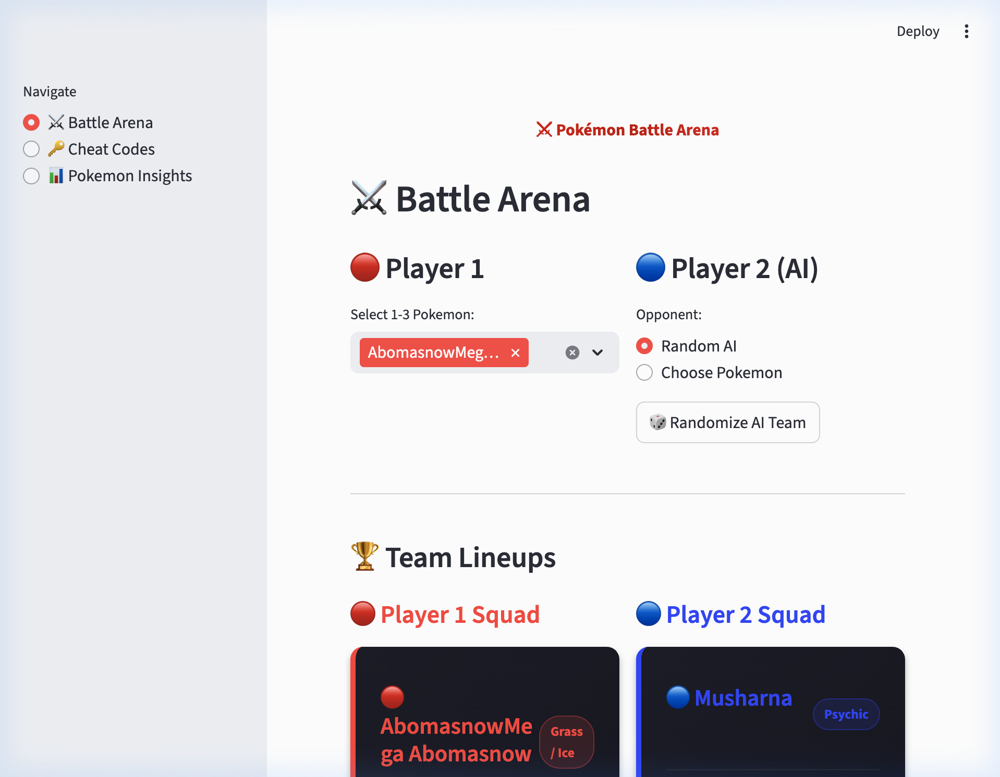
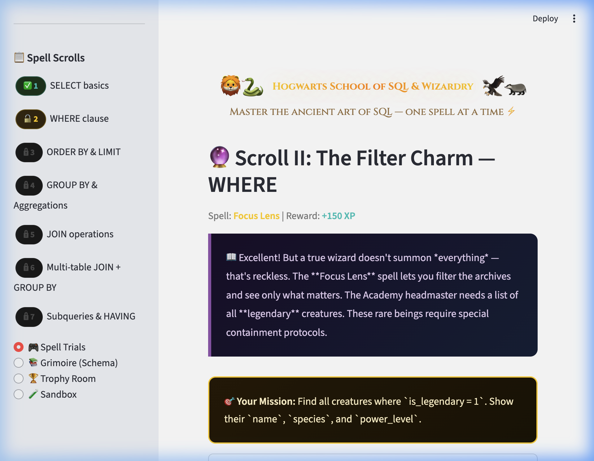

# HW1 - Big Data & SQL — Report

## Student: Guy Kalati

---

## Task 1: Baby Names Explorer (25pt)

### 1.1 Data Loading & Schema Design (5pt)

For this task I loaded the US Baby Names dataset (NationalNames.csv) into a SQLite database using Python's sqlite3 module. The dataset contains about 1.8 million rows, each representing a baby name entry with fields for Id, Name, Year, Gender, and Count.

The schema I designed is pretty straightforward — a single table called `baby_names` with five columns. The Id serves as the primary key, Name and Gender are text fields (with Gender constrained to only 'M' or 'F'), and Year and Count are integers. I kept it simple because the data itself is already in a flat structure and there was no real benefit from normalizing it further.

I created two indexes on this table. The first index is on (name, year), which I chose because the most common query pattern in this app is looking up a specific name and seeing how it performed across different years. Without this index, every popularity query would require a full table scan across 1.8 million rows, which would be noticeably slow. The second index is on (year, gender), which speeds up aggregate queries that group data by year — things like calculating how many total babies were born each year or how many unique names appeared. These year-based aggregations are used in the diversity analysis and pattern discovery sections, so having this index makes those sections much more responsive.

### 1.2 Interactive App (15pt)

I built the interactive app using Streamlit, which I found to be a good fit because it lets you create data-focused web apps quickly with Python. The app has three main visualization features accessible through a sidebar navigation:

**A: Name Popularity Over Time** — The user types in any baby name (or multiple names separated by commas) and sees a line chart showing how popular that name was across all years in the dataset. There is a toggle to switch between raw count mode (total number of babies) and percentage mode (what fraction of all babies born that year had this name). The percentage mode is useful because it accounts for the overall growth in births over time. I used Plotly for the charts because it gives interactive hover effects out of the box. Below the chart I also show summary statistics like total babies named, the peak year, and the peak count.

**B: Custom SQL Query Panel** — This feature lets users write their own SQL queries against the baby_names table. For safety, it only allows SELECT statements — if someone tries to run an INSERT or DELETE, it shows a friendly error message explaining why that is not allowed. I included three pre-built example buttons that auto-fill useful queries: "80s Top Boy Names", "Total Births by Year", and "All-Time Gender Split". When results come back, users can optionally visualize them as bar, line, or pie charts by selecting the appropriate columns for the axes.

**C: Name Diversity Over Time** — This section shows how the number of unique baby names used each year has changed over time. There is an area chart showing the overall trend (from about 1,000 unique names in 1880 to over 30,000 by 2014), a gender breakdown chart, and a gender-neutral name finder. The gender-neutral finder identifies names that have been used significantly for both boys and girls. It ranks them by how balanced the usage is between genders and displays the results in a grouped bar chart.

### 1.3 Pattern Discovery (10pt)

I discovered three patterns in the data:

**Pattern 1: The Decline of Dominant Names.** In the early 1900s, the most popular female name (Mary) accounted for almost 6% of all girls born that year. By 2014, the top name captures less than 1%. This massive decline shows a clear cultural shift toward individuality in naming — parents today pick from a much wider pool of names rather than following a single dominant trend.

**Pattern 2: Celebrity-Driven Name Spikes.** Names like Arya and Khaleesi exploded in popularity after Game of Thrones premiered in 2011. Khaleesi went from literally zero babies to hundreds per year, which is remarkable since it is not even a real name but a fictional title from a TV show. Similarly, Elsa saw a bump after Frozen (2013). This demonstrates how strongly pop culture influences naming decisions.

**Pattern 3: Explosion of Name Diversity.** The number of unique names per year grew from about 1,000 in 1880 to over 30,000 by 2014. This is not just from more babies being born — the ratio of unique names to total babies has increased dramatically. This reflects immigration bringing names from many cultures, parents inventing creative spellings, and a broader social acceptance of unconventional names.

---

## Task 2: Oscar Actor Explorer (25pt)

### 2.1 Data Modeling with ORM (5pt)

For this task I used SQLAlchemy as the ORM, which I chose because it is the most widely used Python ORM and has excellent documentation. I defined a single model class called `OscarNomination` that maps to a `nominations` table. Each row represents one nomination event with columns for year_film, year_ceremony, ceremony number, category, canon_category (the normalized category name), the nominee's name, the film title, and whether they won.

I considered splitting the data into separate tables (like a separate actors table and a films table), but decided against it because the CSV data does not have persistent unique identifiers for people or films. Different people can share the same name, and the same film can appear with slightly different titles across years. Keeping everything in one flat table avoids join ambiguities and makes the ORM queries simpler. The canon_category field is particularly useful because the Academy has changed category names over the years (for example, "ACTOR" became "ACTOR IN A LEADING ROLE"), and this field normalizes those.

I chose SQLAlchemy over PonyORM and Peewee because SQLAlchemy handles complex queries well with its query builder pattern, has good support for aggregations and subqueries through the ORM layer, and is the industry standard that most employers would expect you to know. PonyORM has a nicer syntax for simple queries but lacks some features for more complex analysis. Peewee is lighter-weight but felt too minimal for the kind of aggregation queries this task requires.

### 2.2 Actor Profile App (10pt)

The app shows a rich profile card when you select any Oscar nominee. It combines data from two sources:

From the database (via ORM queries, no raw SQL): it shows the number of nominations and wins, the categories they were nominated in, their years active at the Oscars, and a list of all their nominated and winning films. It also calculates their win rate, compares their nomination count to the average nominee (e.g., Meryl Streep has 21 nominations while the average is 1.6), and computes the gap in years between their first nomination and first win.

From Wikipedia (fetched live via the REST API): it pulls in a short biography summary, their birth description, and a photo when available. The Wikipedia fetch uses the REST API at en.wikipedia.org/api/rest_v1/page/summary with a proper User-Agent header as required by Wikipedia's API policy.

I handle edge cases like actors not found in the dataset (shows a warning), missing Wikipedia data (shows a graceful fallback message), and actors with no wins (shows "No wins yet" and skips the win-gap calculation). There is also an Oscar timeline scatter plot that shows each nomination and win on a visual timeline.

### 2.3 Interesting Finds (10pt)

**Finding 1: The Biggest Snubs.** I filtered the database to only competitive categories (acting, directing, writing, cinematography) and found the individuals with the most nominations who have never won. These are the most heartbreaking stories in Oscar history—repeatedly recognized as among the best, yet the trophy always eluded them.

**Finding 2: The Versatile Visionaries.** Using a category whitelist and an interactive treemap visualization, I identified artists who have been nominated across the most distinct Oscar categories. Click on any artist in the treemap to zoom into their category breakdown.

**Finding 3: The 'Decade Dominators'.** I calculated which artists have earned nominations across the most distinct decades. Staying relevant in Hollywood for one decade is hard—these individuals proved their talent transcends generational trends by earning recognition across 4, 5, or even 6 different decades.

**Bonus: Did You Know?** I implemented a feature that generates personalized fun facts for any nominee via an autocomplete search bar. It calculates what percentile they rank in terms of nominations, shows their win rate, and summarizes their Oscar career span. I also included an "I'm Feeling Lucky" button to randomly select an interesting artist.

---

## Task 3: Pokémon Battle Arena (25pt)

### 3.1 Data Loading & Schema (5pt)

I loaded the Pokemon dataset (800 Pokemon with stats) into SQLite with three tables: `pokemon` (the main stats table with columns for name, types, HP, Attack, Defense, etc.), `type_effectiveness` (a lookup table storing damage multipliers between types), and `battle_log` (a log of all battles played, including which cheats were used). The type_effectiveness table is important because it ensures that type advantages come from the database rather than being hardcoded in the Python code, which aligns with the assignment requirement that all game mechanics be data-driven.

### 3.2 Battle Game (10pt)

The battle game lets each player select 1 to 3 Pokemon from the database. Player 2 can either choose manually or let the AI pick a random team. The battle mechanics are entirely driven by database values:

The damage formula is: base_damage = (max(Attack, Sp.Atk) * 2 / max(Defense, Sp.Def)) * type_multiplier * 10 + random(1,10). The Speed stat determines who goes first each turn — the faster Pokemon attacks first, which can be decisive if it knocks out the opponent before they get to attack. Type effectiveness is pulled from the type_effectiveness database table, so Fire attacks deal 2x damage to Grass Pokemon and 0.5x to Water Pokemon.

The battle runs automatically turn by turn, producing a detailed battle log that shows who attacked whom, how much damage was dealt, and whether the attack was super effective or not very effective. When a Pokemon faints (HP reaches 0), the next Pokemon on the team is automatically sent out. The game ends when one side has no Pokemon remaining.

### 3.3 Cheat Codes (5pt)

I implemented five cheat codes, each one executing a real SQL write operation on the database:

- `UPUPDOWNDOWN` — runs an UPDATE query to double the selected Pokemon's HP
- `GODMODE` — runs an UPDATE to set Defense and Sp.Def to 999
- `MAXPOWER` — runs an UPDATE to set Attack and Sp.Atk to 999
- `LEGENDARY` — runs an INSERT to add a custom overpowered Pokemon called MewThree (stats of 500 across the board)
- `NERF` — runs an UPDATE to halve all stats of every Pokemon except the selected one

Each cheat modifies the actual database, not just Python variables. I also implemented a cheat audit system that can detect which cheats were used by checking for Pokemon with stats exceeding the dataset's natural maximums (e.g., HP above 255, Attack above 190). There is also a database reset button that removes the database file and reinitializes it from the original CSV.

### 3.4 Pokemon Analysis (5pt)

**Insight 1: Most Overpowered Type Combinations.** Dragon/Flying has the highest average total stats among dual-type combinations with at least 3 Pokemon. This makes sense because many Dragon types are pseudo-legendary or legendary Pokemon, which are designed to be rare and powerful.

**Finding 2: The "Glass Cannon" Index.** Approaching the game from a competitive meta perspective, I calculated a "Glassiness Ratio" comparing unadulterated offensive capabilities (Attack + Sp.Atk + Speed) against raw defensive capabilities (HP + Def + Sp.Def). Plotting this creates a fascinating visual index where extreme glass cannons (Gengar, Alakazam) cluster far away from extreme defensive walls (Shuckle, Blissey).

**Finding 3: The Speed Tier Meta by Type.** In competitive battling, Speed is arguably the most critical stat as it dictates the tempo of the entire match. I created a sorted box-and-whisker plot analyzing the base speed distributions across all primary typings. This statistically proves that Electric and Flying types are fundamentally engineered by developers to out-speed the meta, whereas Steel and Rock types pay a heavy mathematical speed penalty in exchange for their type resistances.

---

## Task 4: SQL Learning Game (25pt)

### 4.1 Core Platform (15pt)

I built **SQL Spellcraft Academy**, an immersive wizard-themed SQL learning game where the player is an apprentice wizard who learns to "cast SQL spells" against a fantasy database of magical creatures, wizards, spells, and quests. The platform includes:

A real SQLite database with four richly interconnected tables (`creatures`, `wizards`, `spells`, `quests`) filled with over 40 rows of fantasy-themed data. The learner writes and executes real SQL queries. There are **7 progressive levels** (called "Spell Scrolls") that teach SQL concepts in order: Scroll I (SELECT *), Scroll II (WHERE), Scroll III (ORDER BY & LIMIT), Scroll IV (GROUP BY & COUNT), Scroll V (JOIN), Scroll VI (multi-table JOIN + GROUP BY), and Scroll VII (HAVING & advanced aggregation).

The feedback system checks row counts, column names, and data correctness. If wrong, it provides specific guidance about whether the row count is off, the column set is wrong, or the data doesn't match. After 3 failed attempts, the correct query is revealed.

Progress tracking is displayed visually in the sidebar with badge-style level indicators (✅ completed, 🔓 current, 🔒 locked).

### 4.2 Engagement & Creativity (10pt)

The platform is designed to be genuinely fun and memorable through multiple layers of engagement:

- **Wizard Theme & Narrative:** Each level is a "Spell Scroll" with a rich story. Players progress from Novice Apprentice to Archmage, unlocking named spells (e.g., "Reveal All", "Focus Lens", "Soul Link", "Omni-Vision") as they master SQL concepts.
- **XP & Rank System:** Instead of raw points, the game uses an RPG-style XP system with 6 progression ranks (Novice Apprentice → Spell Scribe → Junior Wizard → Enchanter → Grand Wizard → Archmage). A visual XP progress bar shows how close the player is to their next rank.
- **Adaptive Difficulty:** If a player fails a level 2+ times, a more explicit "step-by-step" sub-hint is automatically revealed, guiding them through the query construction. This ensures beginners never get stuck. 
- **Streak System:** Consecutive correct answers build a streak counter displayed in the sidebar, with special celebration messages at 3+ streaks.
- **Sandbox Mode:** A free-practice "Spell Sandbox" tab lets learners experiment with any SQL query against the full database outside the structured curriculum.
- **Trophy Room:** An achievements/badges system with 10 unique trophies that track progress milestones, XP thresholds, and streaks.
- **Visual Design:** The entire UI uses a dark fantasy aesthetic with custom CSS (Cinzel serif font for headers, gradient cards, animated spell-cast effects, gold/purple color palette) to create an immersive RPG atmosphere.

### 📹 Gameplay Demo Video
Watch a full end-to-end recording of casting the first spell, checking the Trophy Room, and reading the Grimoire below:

---

## Technology Choices

I chose Streamlit as the web framework for all four tasks because it is designed specifically for data applications, requires minimal frontend code, and integrates natively with Plotly charts and pandas DataFrames. SQLite was the database engine for all tasks, used either directly through sqlite3 (Tasks 1, 3, 4) or through SQLAlchemy ORM (Task 2). Plotly was used for all visualizations because it provides interactive charts with hover effects and zoom functionality out of the box.
